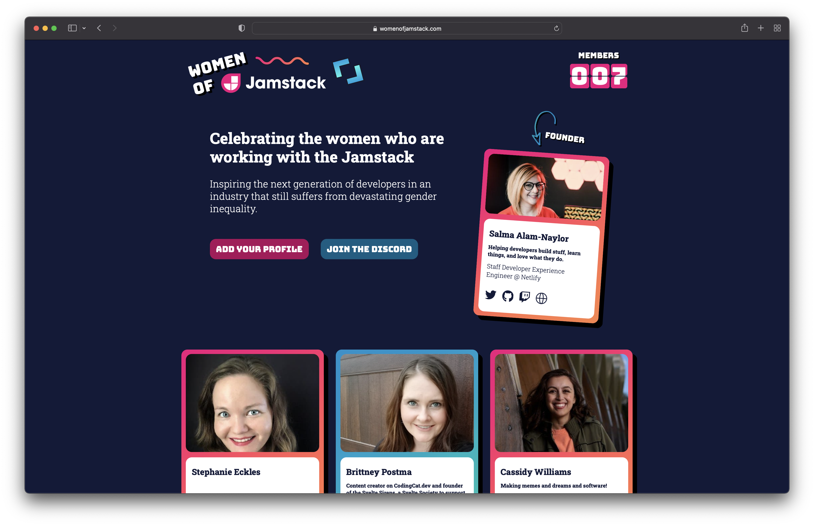

# Women of Jamstack

## Celebrating the women who are working with the Jamstack and adjacent technologies.



## Add your profile to the site

Are you a woman who works with the Jamstack and adjacent technologies? Please submit a pull request to add your profile
to the site!

1. Fork the repository to your GitHub account and clone it to your local machine.

2. Navigate to `src/_data/profiles` and create a new `[yourIdentifier].json` file.

3. Add your details:

```json
// src/_data/profiles/[yourIdentifier].json

{
  "name": "Your name", // required
  "jobTitle": "Your job title", // required
  "company": "Your company", // required
  "bio": "A short bio, around the length of a Twitter bio.", // required
  "githubUsername": "yourGitHubUsername", // optional
  "twitterUsername": "yourTwitterUsername", // optional
  "twitchUsername": "yourTwitchUsername", // optional
  "website": "https://yourwebsite.com/" // optional
}
```

4. Navigate to `src/_data/images` and add a 400x400 JPG image, named `[yourIdentifier.jpg]`.

5. Commit and push your changes, and open up a PR!

---

Women of Jamstack is built with love and [Eleventy](https://www.11ty.dev/docs/).
